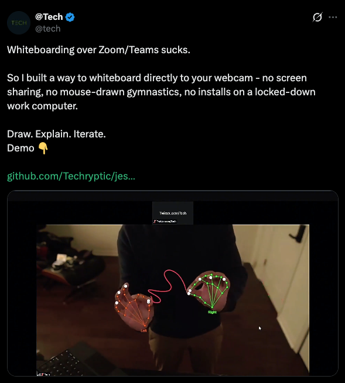

# 🃏 jester

A local-only, browser-based gesture-controlled whiteboard using hand tracking from your webcam (w/ tablet stylus support!). Perfect for presentations, remote meetings, and creative expression.

   




## 🎯 Use Case: Virtual Whiteboard for Video Calls

Use this app as a virtual whiteboard in Teams/Zoom without installing any drivers on your work computer:

```
┌──────────────────────────────────────────────────────────────────┐
│                         LAPTOP A                                 │
│  ┌─────────────┐    ┌──────────────┐    ┌──────────────────┐     │
│  │   Webcam    │───▶│  MediaPipe   │───▶│  Gesture Engine  │     │
│  │   (DSLR)    │    │  Hands ML    │    │  (pinch/palm)    │     │
│  └─────────────┘    └──────────────┘    └────────┬─────────┘     │
│                                                   │              │
│  ┌────────────────────────────────────────────────▼───────────┐  │
│  │                    Whiteboard Canvas                       │  │
│  │  • Hand gesture drawing/erasing                            │  │
│  │  • iPad strokes (via WebSocket)                            │  │
│  │  • Uploaded images                                         │  │
│  └────────────────────────────────────────────────────────────┘  │
│                             │ HDMI                               │
└─────────────────────────────┼────────────────────────────────────┘
                              ▼
┌─────────────────────────────────────────────────────────────────┐
│                      CAPTURE CARD                               │
│                    (HDMI → USB)                                 │
└─────────────────────────────┼───────────────────────────────────┘
                              ▼
┌─────────────────────────────────────────────────────────────────┐
│                        WORK PC                                  │
│  Capture card appears as "Webcam" in Teams/Zoom                 │
└─────────────────────────────────────────────────────────────────┘
```

## ✨ Features

### Core
- **✋ Hand Gesture Control** - Draw, erase, pan, and zoom using natural hand gestures
- **🎨 Drawing Tools** - Customizable pen color and thickness
- **🔍 Infinite Canvas** - Pan and zoom to use as much space as you need
- **🖥️ Fully Local** - All ML processing happens in your browser, no cloud APIs

### Display Options
- **📐 Aspect Ratio Lock** - Choose 16:9, 16:10, 4:3, or custom ratios
- **🪞 Mirror Toggle** - Flip the output for natural gesture control
- **🎬 Presentation Mode** - Hide UI for clean output (press `P`)
- **🎛️ Background Opacity** - Control webcam overlay transparency

### Templates
- **📹 Webcam Only** - Pure webcam background
- **⬜ Blank** - Clean white background
- **📏 Grid / Dot Grid / Lines** - Structured backgrounds for diagrams

### Collaboration
- **📱 iPad Sync** - Draw with Apple Pencil, strokes appear in real-time
- **🎚️ Remote Gesture Toggles** - Control gestures from iPad

### Extras
- **🫲 Left-Handed Mode** - Swap gestures for left-handed users
- **↩️ Undo/Redo** - Easily fix mistakes
- **📤 Image Upload** - Import diagrams and annotate them
- **🐛 Debug Mode** - Visualize hand tracking and gesture recognition

## 🖐️ Gestures

**Default (Left-Handed Mode ON):**

| Gesture | Action |
|---------|--------|
| **Left Hand Pinch** | Draw on the whiteboard |
| **Right Palm Open** | Erase strokes |
| **Left Palm Open** | Pan the canvas |
| **Both Hands Pinch** | Zoom in/out |

*In Right-Handed Mode, draw and erase swap hands.*

## 🚀 Getting Started

### Prerequisites

- Node.js 18+ 
- A webcam (USB webcam or DSLR via capture card)
- Chrome, Edge, or another Chromium-based browser

### Quick Start

```bash
# Clone the repository
git clone https://github.com/yourusername/jester.git
cd jester

# Install dependencies
npm install

# Start the server (includes iPad sync)
npm run server
```

Open `http://localhost:3000` in your browser.

### Development

```bash
npm run dev      # Start dev server with hot reload
npm run build    # Build for production
npm run preview  # Preview production build
```

### iPad Sync Mode

Draw on your iPad with Apple Pencil and see strokes appear on your desktop whiteboard in real-time!

```bash
npm run server
```

```
🖐️  Jester Server Started!

📱 Desktop (main app):
   http://localhost:3000
   http://192.168.x.x:3000

✏️  iPad/Tablet (drawing):
   http://192.168.x.x:3000/draw
```

1. Open the desktop URL in your browser
2. On your iPad (same WiFi network), go to the `/draw` URL
3. Draw with your Apple Pencil - strokes sync instantly!

## 📁 Project Structure

```
src/
├── types/
│   └── index.ts              # TypeScript type definitions
├── handTracking/
│   ├── HandTracker.ts        # MediaPipe Hands wrapper
│   └── LandmarkSmoother.ts   # EMA smoothing for landmarks
├── gestures/
│   └── GestureEngine.ts      # Gesture detection with hysteresis
├── whiteboard/
│   └── WhiteboardEngine.ts   # Board state, camera, strokes
├── rendering/
│   └── Renderer.ts           # Canvas rendering
├── sync/
│   └── SyncClient.ts         # WebSocket client for iPad sync
├── ui/
│   └── UIManager.ts          # Control panel UI
├── main.ts                   # Application entry point
└── style.css                 # Global styles

server.ts                     # Express + WebSocket server
public/draw.html              # iPad drawing interface
```

## 🏗️ Architecture

### Data Flow

```
Webcam → MediaPipe Hands → Gesture Engine → Whiteboard Engine → Renderer
                                                    ↑
                                            iPad WebSocket
```

### Hand Tracking
Uses MediaPipe Hands for real-time hand landmark detection. The model runs entirely in the browser using WebAssembly and WebGL.

### Gesture Engine
Processes hand landmarks to detect gestures:
- **Pinch Detection**: Distance between thumb tip and index tip
- **Palm Open Detection**: All fingers extended
- **Hysteresis**: Requires N frames to activate/deactivate (prevents flickering)

### Coordinate Systems
- **Normalized Space (0-1)**: From MediaPipe hand tracking
- **Screen Space**: Canvas pixel coordinates
- **World Space**: Infinite logical coordinates for the whiteboard

## ⚙️ Configuration

### Display Options
| Setting | Description |
|---------|-------------|
| Aspect Ratio | Lock to 16:9, 16:10, 4:3, or custom |
| Mirror Output | Flip video horizontally |
| Presentation Mode | Hide control panel (press P) |

### Advanced Tuning
| Setting | Description | Default |
|---------|-------------|---------|
| Pinch Threshold | How close fingers must be to trigger | 0.05 |
| Palm Threshold | How open hand must be | 0.2 |
| Erase Radius | Size of eraser in pixels | 40 |
| Smoothing | Reduces hand jitter (0.1-0.9) | 0.4 |

## 📊 Technical Details

### Performance Targets
- Hand tracking: ≥15 FPS
- Rendering: ≥30 FPS
- Gesture latency: ~150-250ms

### Browser Requirements
- WebGL 2.0 support
- WebAssembly support
- getUserMedia API (webcam access)

## 🔮 Future Improvements

- [ ] Save/Load boards to local storage
- [ ] Export to PNG/SVG
- [ ] Virtual camera output (OBS integration)
- [ ] Pressure sensitivity (Apple Pencil)
- [ ] Laser pointer mode
- [ ] Shape recognition
- [ ] Keyboard shortcuts

## 📄 License

MIT License - feel free to use and modify as needed.

## 🙏 Acknowledgments

- [MediaPipe](https://mediapipe.dev/) - Hand tracking ML model
- [Vite](https://vitejs.dev/) - Build tool
- [Express](https://expressjs.com/) - Server framework
